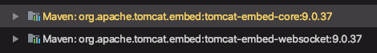

# 내장 웹 서버 이해

스프링 부트는 서버가 아니다.

* 톰캣객체생성

- 포트설정
- 톰캣에 컨텍스트 추가
- 서블릿 만들기
- 톰캣에 서블릿 추가
-  컨텍스트에 서블릿 맵핑
- 톰캣 실행 및 대기

이 모든 과정을 보다 상세히 또 유연하고, 설정하고 실행해주는게 바로 스프링부트의 자동 설정.

* ServletWebServerFactoryAutoConfiguration (서블릿 웹 서버 생성)
  * TomcatServletWebServerFactoryCustomizer (서버 커스터마이징)

* DispatcherServletAutoConfiguration
  * 서블릿 만들고 등록

---

지난 시간에 스프링 부트 어플리케이션을 웹서버가 아닌 상태로 띄우는 방법을 살펴봤었다. 즉, 스프링 부트 자체는 서버가 아니라 `Tool`이다. 내장 서블릿 컨테이너, 스프링 프레임워크를 쉽게 사용하게 해주는 툴이다.

```java
// 스프링부트 애플리케이션을 서버가 아닌 상태로 실행
public class Application {
  public static void main(String[] args) {
    SpringApplication application = new SpringApplication(Application.class);
    application.setWebApplicationType(WebApplicationType.NONE); //좀 더 빨리 실행되도록 타입 변경
    application.run(args);
  }
}
```


서버 종류에는 Tomcat, Netty, Jetty, Undertow가 있다.

그리고, 자바 코드로 서버를 만들 수 있도록 기능을 제공해준다.

기본 스프링부트 프로젝트를 만들면, 의존성에는 톰캣이 들어와 있다.

`tomcat-embed-xxx` 의존성이 들어와있는 것을 확인할 수 있다.




#### 자바 코드로 톰캣 만들기

1. 톰캣 객체 생성
2. 포트 설정
3. 톰캣에 컨텍스트 추가

```java
public class Application {

    public static void main(String[] args) throws LifecycleException {
        // 1. 톰캣 객체 생성
        Tomcat tomcat = new Tomcat();
        // 2. 포트 설정
        tomcat.setPort(8080);

        // 3. 톰캣에 컨텍스트 추가
        // tomcat.addContext(contextPath, docBase)
        Context context = tomcat.addContext("/", "/");

        tomcat.start();
//        tomcat.getServer().await(); // await()하면 요청을 기다리는 상태로 끝나지 않고 대기하게 된다.
    }
}
```

⇒ 실행 후 에러 없으면 ok

* 이전에 띄워둔 톰캣이 살아있다면 죽이고 다시 실행

tomcat 프로세스 조회 및 종료

```shell
> ps -ef | grep tomcat
// UID PID PPID 로 결과 출력됨
> kill -9 {PID}
// PID로 해당 프로세스 종료
```


4. 서블릿 만들기
   * doGet() : get 요청에 대한 서블릿

 ```java
// 4. 서블릿 생성
HttpServlet servlet = new HttpServlet() {
  @Override
  protected void doGet(HttpServletRequest req, HttpServletResponse resp) throws ServletException, IOException {
    PrintWriter writer = resp.getWriter();
    writer.println("<html><head><title>");
    writer.println("Hey, Tomcat");
    writer.println("</title></head>");
    writer.println("<body><h1>Hello Tomcat</h1></body>");
    writer.println("</html>");
  }
};
 ```


5. 톰캣에 서블릿 등록

* `tomcat.addServlet(String contextPath, String servletName, String servletClass);`
  * servlet을 servletName명으로 context에 추가

```java
String servletName = "helloServlet";
tomcat.addServlet("/", servletName, servlet); // servlet을 servletName명으로 context에 추가
```


6. 컨텍스트에 서블릿 맵핑

* `context.addServletMappingDecoded(String pattern, String name);`
  * pattern : 어느 URL로 들어왔을 때, 서블릿을 보여줄 것인지 설정
  * name : 서블릿명

```java
context.addServletMappingDecoded("/hello", servletName);
```


7. 톰캣 실행 및 대기

```java
tomcat.start();
tomcat.getServer().await(); // await()하면 요청을 기다리는 상태로 끝나지 않고 대기하게 된다.
```


※ 전체 코드

```java
package dev.solar;

import org.apache.catalina.Context;
import org.apache.catalina.LifecycleException;
import org.apache.catalina.startup.Tomcat;

import javax.servlet.http.HttpServlet;
import javax.servlet.http.HttpServletRequest;
import javax.servlet.http.HttpServletResponse;
import java.io.IOException;
import java.io.PrintWriter;

public class Application {

  public static void main(String[] args) throws LifecycleException {
    // 1. 톰캣 객체 생성
    Tomcat tomcat = new Tomcat();
    // 2. 포트 설정
    tomcat.setPort(8080);

    // 3. 톰캣에 컨텍스트 추가
    Context context = tomcat.addContext("/", "/");

    // 4. 서블릿 생성
    HttpServlet servlet = new HttpServlet() {
      // doGet : get 요청에 대한 서블릿
      @Override
      protected void doGet(HttpServletRequest req, HttpServletResponse resp) throws IOException {
        PrintWriter writer = resp.getWriter();
        writer.println("<html><head><title>");
        writer.println("Hey, Tomcat");
        writer.println("</title></head>");
        writer.println("<body><h1>Hello Tomcat</h1></body>");
        writer.println("</html>");
      }
    };

    // 5. 톰캣에 서블릿 등록
    String servletName = "helloServlet";
    tomcat.addServlet("/", servletName, servlet); // servlet을 servletName명으로 context에 추가

    // 6. 컨텍스트에 서블릿 맵핑
    context.addServletMappingDecoded("/hello", servletName);

    tomcat.start();
    tomcat.getServer().await(); // await()하면 요청을 기다리는 상태로 끝나지 않고 대기하게 된다.
  }
}
```


