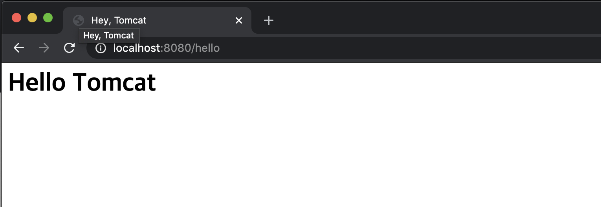

# 내장 웹 서버 이해

스프링 부트는 서버가 아니다.

* 톰캣객체생성

- 포트설정
- 톰캣에 컨텍스트 추가
- 서블릿 만들기
- 톰캣에 서블릿 추가
-  컨텍스트에 서블릿 맵핑
- 톰캣 실행 및 대기

이 모든 과정을 보다 상세히 또 유연하고, 설정하고 실행해주는게 바로 스프링부트의 자동 설정.

* ServletWebServerFactoryAutoConfiguration (서블릿 웹 서버 생성)
  * TomcatServletWebServerFactoryCustomizer (서버 커스터마이징)

* DispatcherServletAutoConfiguration
  * 서블릿 만들고 등록

---

지난 시간에 스프링 부트 어플리케이션을 웹서버가 아닌 상태로 띄우는 방법을 살펴봤었다. 즉, 스프링 부트 자체는 서버가 아니라 `Tool`이다. 내장 서블릿 컨테이너, 스프링 프레임워크를 쉽게 사용하게 해주는 툴이다.

```java
// 스프링부트 애플리케이션을 서버가 아닌 상태로 실행
public class Application {
  public static void main(String[] args) {
    SpringApplication application = new SpringApplication(Application.class);
    application.setWebApplicationType(WebApplicationType.NONE); //좀 더 빨리 실행되도록 타입 변경
    application.run(args);
  }
}
```


서버 종류에는 Tomcat, Netty, Jetty, Undertow가 있다.

그리고, 자바 코드로 서버를 만들 수 있도록 기능을 제공해준다.

기본 스프링부트 프로젝트를 만들면, 의존성에는 톰캣이 들어와 있다.

`tomcat-embed-xxx` 의존성이 들어와있는 것을 확인할 수 있다.


#### 자바 코드로 톰캣 만들기

1. 톰캣 객체 생성

2. 포트 설정

   ★ `Connector`임베디드 서버에를 추가하지 않은 것 같습니다 . Tomcat 9는 더 이상 `Connector`서버에 자동으로 추가하지 않으므로 직접 트리거해야한다.

   ```java
   tomcat.getConnector(); // Trigger the creation of the default connector
   ```

3. 톰캣에 컨텍스트 추가

```java
public class Application {

  public static void main(String[] args) throws LifecycleException {
    // 1. 톰캣 객체 생성
    Tomcat tomcat = new Tomcat();
    // 2. 포트 설정
    tomcat.setPort(8080);
    tomcat.getConnector(); // <-- tomcat 9 버전부터 적어줘야함!!!

    // 3. 톰캣에 컨텍스트 추가
    // tomcat.addContext(contextPath, docBase)
    Context context = tomcat.addContext("/", "/");

    tomcat.start();
    //        tomcat.getServer().await(); // await()하면 요청을 기다리는 상태로 끝나지 않고 대기하게 된다.
  }
}
```

⇒ 실행 후 에러 없으면 ok

* 이전에 띄워둔 톰캣이 살아있다면 죽이고 다시 실행

tomcat 프로세스 조회 및 종료

```shell
> ps -ef | grep tomcat
// UID PID PPID 로 결과 출력됨
> kill -9 {PID}
// PID로 해당 프로세스 종료
```


4. 서블릿 만들기
   * doGet() : get 요청에 대한 서블릿

 ```java
// 4. 서블릿 생성
HttpServlet servlet = new HttpServlet() {
  @Override
  protected void doGet(HttpServletRequest req, HttpServletResponse resp) throws ServletException, IOException {
    PrintWriter writer = resp.getWriter();
    writer.println("<html><head><title>");
    writer.println("Hey, Tomcat");
    writer.println("</title></head>");
    writer.println("<body><h1>Hello Tomcat</h1></body>");
    writer.println("</html>");
  }
};
 ```


5. 톰캣에 서블릿 등록

* `tomcat.addServlet(String contextPath, String servletName, String servletClass);`
  * servlet을 servletName명으로 context에 추가

```java
String servletName = "helloServlet";
tomcat.addServlet("/", servletName, servlet); // servlet을 servletName명으로 context에 추가
```


6. 컨텍스트에 서블릿 맵핑

* `context.addServletMappingDecoded(String pattern, String name);`
  * pattern : 어느 URL로 들어왔을 때, 서블릿을 보여줄 것인지 설정
  * name : 서블릿명

```java
context.addServletMappingDecoded("/hello", servletName);
```


7. 톰캣 실행 및 대기

```java
tomcat.start();
tomcat.getServer().await(); // await()하면 요청을 기다리는 상태로 끝나지 않고 대기하게 된다.
```


※ 전체 코드

```java
package dev.solar;

import org.apache.catalina.Context;
import org.apache.catalina.LifecycleException;
import org.apache.catalina.startup.Tomcat;

import javax.servlet.http.HttpServlet;
import javax.servlet.http.HttpServletRequest;
import javax.servlet.http.HttpServletResponse;
import java.io.IOException;
import java.io.PrintWriter;

public class Application {

  public static void main(String[] args) throws LifecycleException {
    // 1. 톰캣 객체 생성
    Tomcat tomcat = new Tomcat();
    // 2. 포트 설정
    tomcat.setPort(8080);
    tomcat.getConnector(); // <-- tomcat 9 버전부터 적어줘야함!!!

    // 3. 톰캣에 컨텍스트 추가
    Context context = tomcat.addContext("/", "/");

    // 4. 서블릿 생성
    HttpServlet servlet = new HttpServlet() {
      // doGet : get 요청에 대한 서블릿
      @Override
      protected void doGet(HttpServletRequest req, HttpServletResponse resp) throws IOException {
        PrintWriter writer = resp.getWriter();
        writer.println("<html><head><title>");
        writer.println("Hey, Tomcat");
        writer.println("</title></head>");
        writer.println("<body><h1>Hello Tomcat</h1></body>");
        writer.println("</html>");
      }
    };

    // 5. 톰캣에 서블릿 등록
    String servletName = "helloServlet";
    tomcat.addServlet("/", servletName, servlet); // servlet을 servletName명으로 context에 추가

    // 6. 컨텍스트에 서블릿 맵핑
    context.addServletMappingDecoded("/hello", servletName);

    tomcat.start();
    tomcat.getServer().await(); // await()하면 요청을 기다리는 상태로 끝나지 않고 대기하게 된다.
  }
}
```


실행 후, 웹브라우저에서 접속




---

## 스프링 부트 내장 톰캣 자동 설정

이러한 톰캣 설정이 어디에있어서 스프링부트가 내장 톰캣을 띄워주는 것일까?

`spring-boot-autoconfigure`의 `spring.factories` 자동설정 파일 중,

`ServletWebServerFactoryAutoConfiguration` 을 보자


서블릿 웹서버를 설정해주는 자동 설정 내용이다.


ServletRequest.class 가 클래스에 있으면 자동설정을 사용한다. 

```java
@ConditionalOnClass(ServletRequest.class)
```


Import로 다른 Configuration을 가져와서 사용하고 있다.

```java
@Import({ ServletWebServerFactoryAutoConfiguration.BeanPostProcessorsRegistrar.class,
		ServletWebServerFactoryConfiguration.EmbeddedTomcat.class,
		ServletWebServerFactoryConfiguration.EmbeddedJetty.class,
		ServletWebServerFactoryConfiguration.EmbeddedUndertow.class })
```


* `EmbeddedTomcat.class` 내용 확인

`ConditionalOnClass` 조건에 맞고, 우리가 따로 `EmbeddedTomcat`을 만들지 않는다면 `TomcatServletWebServerFactory` 빈을 사용하게 된다.

```java
class ServletWebServerFactoryConfiguration {

   @Configuration(proxyBeanMethods = false)
   @ConditionalOnClass({ Servlet.class, Tomcat.class, UpgradeProtocol.class })
   @ConditionalOnMissingBean(value = ServletWebServerFactory.class, search = SearchStrategy.CURRENT)
   static class EmbeddedTomcat {

      @Bean
      TomcatServletWebServerFactory tomcatServletWebServerFactory( ... ){}
```

 

* `TomcatServletWebServerFactory` 확인

Tomcat 에 대한 여러 설정들이 있다.

```java
@Override
public WebServer getWebServer(ServletContextInitializer... initializers) {
  if (this.disableMBeanRegistry) {
    Registry.disableRegistry();
  }
  Tomcat tomcat = new Tomcat();
  File baseDir = (this.baseDirectory != null) ? this.baseDirectory : createTempDir("tomcat");
  tomcat.setBaseDir(baseDir.getAbsolutePath());
  Connector connector = new Connector(this.protocol);
  connector.setThrowOnFailure(true);
  tomcat.getService().addConnector(connector);
  customizeConnector(connector);
  tomcat.setConnector(connector);
  tomcat.getHost().setAutoDeploy(false);
  configureEngine(tomcat.getEngine());
  for (Connector additionalConnector : this.additionalTomcatConnectors) {
    tomcat.getService().addConnector(additionalConnector);
  }
  prepareContext(tomcat.getHost(), initializers);
  return getTomcatWebServer(tomcat);
}
```


prepareContext()에서 context 설정, classLoader 설정

⇒ 무슨 일을 하는지 상세하게 알 필요는 없고," 자동 설정으로 톰캣이 만들어지는 것이고, 내장 서블릿 컨테이너가 만들어지는 것이다 "라는 것만 알면 된다.


* `ServletWebServerFactoryAutoConfiguration` ⇒ 서블릿 웹 서버 생성. 내장 설정 파일을 만드는 코드
  * `TomcatServletWebServerFactoryCustomizer`  ⇒ 서버 커스터마이징

* `DispatcherServletAutoConfiguratio` ⇒ 서블릿 만들고 등록


* 생성한 서블릿은 스프링 MVC 특히, 서블릿 기반의 MVC라면 DispatcherServlet을 만들어야 한다.

* HttpServlet을 상속해서 만든 스프링의 MVC의 핵심 클래스인 `DispatcherServlet`을 생성한다.

* 서블릿 컨테이너에 등록하는 기능은 별도로 떨어져 있다.

* why?

  서블릿 컨테이너는 pom.xml에 우리가 해주는 설정에 따라 다 달라질 수 있다. 서블릿은 변하지 않는다. 그러므로 둘이 분리되어 있는 것이다.

  내가 어떠한 서블릿 컨테이너를 사용하던지 상관없이 서블릿을 만든 후에 지금 있는 서블릿 컨테이너에 등록하는 과정이 따로 이루어지는 것이다.

⇒ 깊게 이해하는 것은 나아아아중에 (가성비가 좋지 않음.)


---

### Tomcat 9 버전에서 달라진 점 - 웹서버가 안뜨는 경우

tomcat 9 버전부터는 getConnector() 를 자동으로 추가해주지 않는다고 하네요.

tomcat.setPort(8080); 
코드 밑에

tomcat.getConnector(); 
를 추가하는 것만으로 해결이 가능

[참고] : https://stackoverflow.com/questions/48998387/code-works-with-embedded-apache-tomcat-8-but-not-with-9-whats-changed/49011424


