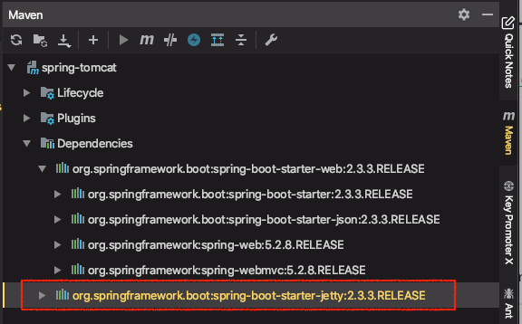
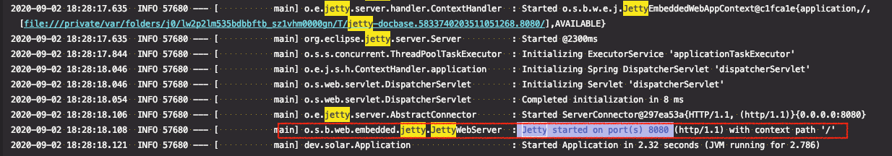
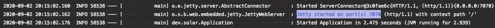
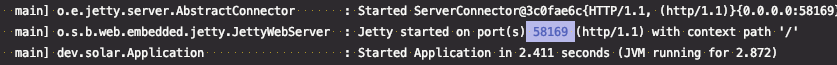
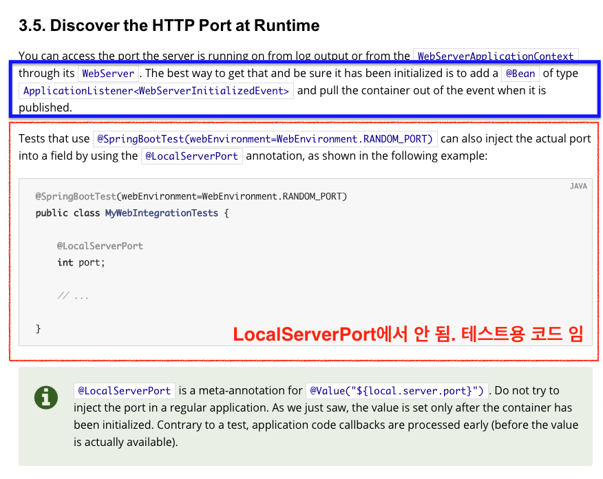
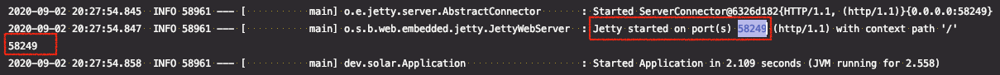

# 내장 웹서버 응용 1부 : 컨테이너와 서버 포트

[Spring Docs - how to embedded web servers](https://docs.spring.io/spring-boot/docs/current/reference/html/howto-embedded-web-servers.html)

다른 서블릿 컨테이너로 변경

웹 서버 사용하지 않기

포트

* server.port
* 랜덤포트
* ApplicationListner<ServletWebServerInitializedEvent>

---

## 다른 서블릿 컨테이너 사용

서블릿기반의 웹 MVC 어플리케이션을 개발할 때 기본적으로 톰캣을 사용하게 된다. 

why? 톰캣 의존성이 들어가 있고, 톰캣 자동설정에 의해서

의존성 목록을 보면, `spring-boot-starter`가 `spring-boot-starter-tomcat`을 가져온다. 이 의존성을 먼저 빼고 다른 것을 넣어주면 된다.

1. `spring-boot-starter`로 추후에 따라오는 의존성들 가운데  `spring-boot-starter-tomcat`을 제외하도록 수정

```xml
<dependency>
  <groupId>org.springframework.boot</groupId>
  <artifactId>spring-boot-starter-web</artifactId>
  <!-- 추가 start -->
  <exclusions>
    <exclusion>
      <groupId>org.springframework.boot</groupId>
      <artifactId>spring-boot-starter-tomcat</artifactId>
    </exclusion>
  </exclusions>
  <!-- 추가 end -->
</dependency>
```


2. 사용하려는 새로운 서블릿 컨테이너 의존성 추가

직접 넣지 않고, stater를 통해서 넣는다.

spring-boot-starter-jetty 또는 spring-boot-starter-undertow 등 원하는 것을 넣어줌

```xml
<dependency>
  <groupId>org.springframework.boot</groupId>
  <artifactId>spring-boot-starter-jetty</artifactId>
</dependency>
```


spring-boot-starter 하위에 있던 tomcat 의존성이 사라지고, jettey가 들어와 있다.




스프링부트 어플리케이션을 실행하면 Jetty로 8080포트에 웹서버가 띄워진 것을 확인할 수 있다.

```java
@SpringBootApplication
public class Application {

    public static void main(String[] args) {
        SpringApplication.run(Application.class, args);
    }
}
```




## 웹 서버 사용하지 않기

웹 관련 의존성이 들어와있으면 스프링부트는 기본적으로 웹 어플리케이션으로 만드려고 시도한다.

이전에 `WebApplicationType.NONE`를 이용해서 서버를 사용하지 않도록 타입을 바꿨었다. 

이번에는 `properties`를 사용해서 바꾸는 방법을 알아보자

* src > main > resources > application.properties 생성 후, 다음과 같이 작성

```properties
spring.main.web-application-type=none
```

웹 서블릿 관련 의존성들이 classPath에 있더라도 무시하고, Non Web Application으로 실행 후 종료된다.


## 포트

#### 1. 포트 변경

* src > main > resources > application.properties

```properties
server.port=7070
```



7070 포트로 웹서버가 띄워진 것 확인


#### 2. 랜덤 포트 사용

`server.port`값을 0으로 주면 된다. 랜덤으로 사용할 수 있는 포트를 찾아서 띄워준다.

* src > main > resources > application.properties

```properties
server.port=7070
```




#### 3. 이렇게 변경한 (랜덤한) 포트를 어플리케이션에서 사용하는 방법

문서를 보면 `ApplicationListner<ServletWebServerInitializedEvent>` 가 가장 좋은 방법이라고 나와있다.




* 이벤트 리스터 역할을 할 빈을 생성

`ApplicationListener<리스너가 받을 이벤트 타입>`

웹서버가 생성이되면 이 이벤트 리스터가 호출된다. 

서블릿 웹 서버 applicationContext이기 때문에 webServer 정보를 알 수 있고, 이 webServer를 통해서 port 정보를 알 수 있다.

```java
import org.springframework.boot.web.servlet.context.ServletWebServerApplicationContext;
import org.springframework.boot.web.servlet.context.ServletWebServerInitializedEvent;
import org.springframework.context.ApplicationListener;
import org.springframework.stereotype.Component;

@Component
public class PortListener implements ApplicationListener<ServletWebServerInitializedEvent> { //웹서버가 생성이되면 이 이벤트 리스터가 호출된다.
  @Override
  public void onApplicationEvent(ServletWebServerInitializedEvent servletWebServerInitializedEvent) {
    //포트 정보를 알아내는 방법
    ServletWebServerApplicationContext applicationContext = servletWebServerInitializedEvent.getApplicationContext();
    //서블릿 웹 서버 applicationContext이기 때문에 webServer 정보를 알 수 있고, webServer를 통해서 port 정보를 알 수 있다.
    System.out.println(applicationContext.getWebServer().getPort());
  }
}
```


로그와 직접 찍은 포트 번호가 동일한 것 확인



WebServer가 실행되자마자 PortListner(이벤트 리스터 핸들러)의 onApplicationEvent 콜백이 실행된 것이다.


---

### 3.6. Enable HTTP Response Compression

HTTP response compression is supported by Jetty, Tomcat, and Undertow. It can be enabled in `application.properties`, as follows:

```properties
server.compression.enabled=true
```

By default, responses must be at least 2048 bytes in length for compression to be performed. You can configure this behavior by setting the `server.compression.min-response-size` property.

By default, responses are compressed only if their content type is one of the following:

- `text/html`
- `text/xml`
- `text/plain`
- `text/css`
- `text/javascript`
- `application/javascript`
- `application/json`
- `application/xml`


응답을 압축해서 보낸다.

기본적으로 다음 타입들이 압축해도 괜찮은 타입들이므로 위 타입들만 압축해서 보낸다. 


##### 정리

1. 다른 서블릿 컨테이너 사용
- spring-boot-starter 의 하위 의존성에서 tomcat 의존성을 제외하도록 추가
- 새로운 컨테이너 의존성 추가
2. 웹 서버 사용하지 않기
- application.properties 파일에 spring.main.web-application-type=none 추가
3. 포트
- application.properties 에서 server.port에 특정 포트를 지정하거나 0번으로 하면 랜덤하게 지정됨
- 포트 사용 : 이벤트리스너 빈을 생성해서 포트번호를 알아올 수 있다.