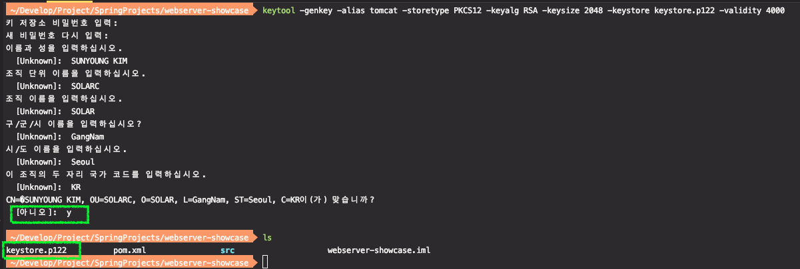
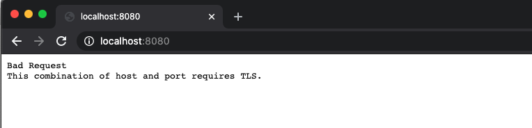
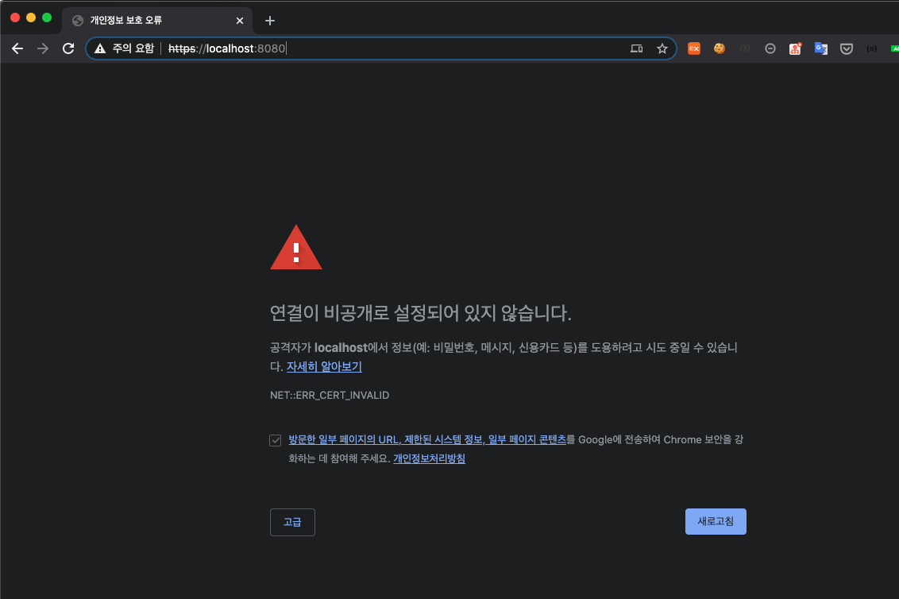
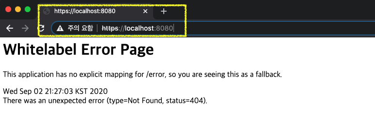
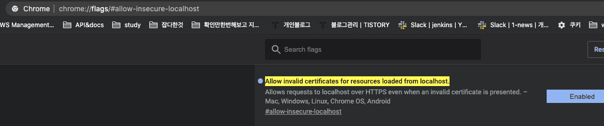
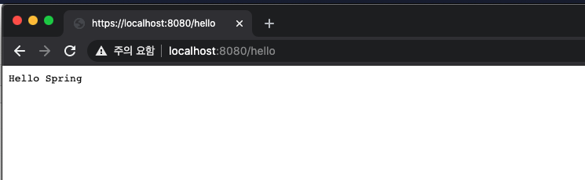
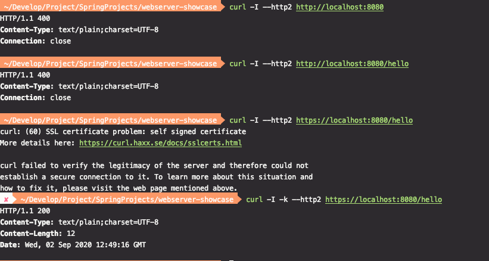
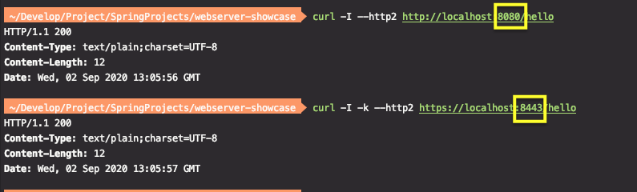

# 내장 웹 서버 응용 2부: HTTPS와 HTTP2

* [생활코딩 - HTTPS와 SSL 인증서 강의](https://opentutorials.org/course/228/4894)

* [키스토어 생성방법](https://gist.github.com/keesun/f93f0b83d7232137283450e08a53c4fd)


HTTPS 설정하기

- 키스토어 만들기
- HTTP는 못쓰네?

HTTP 커넥터는 코딩으로 설정하기

* https://github.com/spring-projects/spring-boot/tree/v2.0.3.RELEASE/spring-boot-samples/spring-boot-sample-tomcat-multi-connectors

HTTP2 설정

* server.http2.enable
* **사용하는 서블릿 컨테이너 마다 다름**

---

* (new project) webserver-showcase 새로운 프로젝트 생성

  ```java
  @SpringBootApplication
  public class Application {
      public static void main(String[] args) {
          SpringApplication.run(Application.class, args);
      }
  }
  ```


## HTTPS 설정하기

### 1. 키스토어 만들기

쉘에 수동으로 작성해서 만들기 (복붙안될 수도)

```sh
# generate-keystore.sh
keytool -genkey 
  -alias tomcat 
  -storetype PKCS12 
  -keyalg RSA 
  -keysize 2048 
  -keystore keystore.p122
  -validity 4000
```


keytool -genkey : key를 생성하겠다.
  -alias tomcat  : 별칭
  -storetype PKCS12  : 지원하는 storetype이 서블릿마다 다르다. 주요 3가지 타입이 있다. PKCS12와 JKS만 지원?
  -keyalg RSA 
  -keysize 2048 
  -keystore keystore.p12 : 키스토어 이름?
  -validity 4000 : 유요한 기간


(로컬에서 만드는 인증서 이므로 아무렇게나 만들어도 괜찮다. )

* 마지막에 `yes`아니고 `y`로 해야 생성 완료됨



* 키스토어 삭제 

  ```sh
  rm -rf ./keystore.p12
  ```

  

### 2. 키스토어 셋팅

application.properties 에 앞서 생성한 키스토어값으로 셋팅을 한다.

* keystore를 Application root 디렉토리가 아니라 resource 하위 즉, classpath에 넣었다면 다음과 같이 `classpath` prefix를 추가
  * server.ssl.key-store=`classpath:`keystore.p12 

```properties
# application.properties
server.ssl.key-store: keystore.p12
# server.ssl.key-store=classpath:keystore.p122 
server.ssl.key-store-password: 123456
server.ssl.keyStoreType: PKCS12
server.ssl.keyAlias: tomcat
```


⇒ 실행 웹브라우저에 접속하면 "Bad Request" TLS로 요청하라는 응답이 온다.




스프링부트는 기본적으로 tomcat이 사용하는 커넥터가 하나만 등록된다. 커넥터에 SSL을 적용해준다. 앞으로 모든 요청은 `HTTPs`로 해야한다.


⇒ `https`로 접속해보자




why??

브라우저가 웹서버에 요청을 보냈을 때, 웹서버는 우리가 생성한 인증서를 보내는데, 브라우저는 해당 인증서의 `public key`값을 모르는 상태이기 때문이다.

`공인된 인증서` - godaddy 등등...

이런 인증서에 발급한 pub key는 대부분의 브라우저에서 알고 있다. 이런 화면이 뜨지 않는다.

우리가 로컬에서 만든 인증서는 브라우저가 알 수가 없다. 즉, HTTPS이긴 하지만, 전혀 공식적으로 발급된 인증서가 아니기 때문에 어떠한 웹사이트인지 전혀 모르는 것이다. 따라서 접속할 것인지 묻는 것이다.


⇒ 무시하고 접속




#### ※ HTTPs 무시하고 접속하는 링크가 안보이는 경우

크롬의경우 localhost에서 로드된 유효하지않은 인증서를 허용하는 방식으로 해결할 수 있습니다.

크롬브라우저의경우 아래의 url을 입력하신후

```
chrome://flags/#allow-insecure-localhost
```

젤위에 `Allow invalid cetificates for resources loaded from localhost`를 Disabled에서 `Enabled`로 변경




#### 요청에 대한 컨트롤러하나 추가

```java
@SpringBootApplication
@RestController
public class Application {

    @GetMapping("/hello")
    public String hello() {
        return "Hello Spring";
    }

    public static void main(String[] args) {
        SpringApplication.run(Application.class, args);
    }
}
```




#### CLI 에서 HTTP 요청을 보내보자

```sh
curl -I --http2 http://localhost:8080/			 // => 요청거부
curl -I --http2 http://localhost:8080/hello		//=> 요청거부
curl -I --http2 https://localhost:8080/hello 	//=> https 는 공인 인증서가 아니라서 나오는 메시지
curl -I -k --http2 https://localhost:8080/hello //=> 옵션 -k 로 무시하고 접속
```





`--http2` 옵션으로 http2로 요청을 보내도 응답을 보면 `HTTP/1.1 ` 로 1.1 버전으로 받고 있다.


⇒ 결론.

HTTPS를 적용하면 더 이상 HTTP는 쓸 수 없다.

스프링부트는 기본적으로 tomcat이 사용하는 커넥터가 하나만 등록된다고 했으므로 HTTP를 받을 커넥터가 없다.

별도로 코딩으로 설정할 수 있다.


---

## HTTP 커넥터는 코딩으로 설정하기

* https://github.com/spring-projects/spring-boot/tree/v2.0.3.RELEASE/spring-boot-samples/spring-boot-sample-tomcat-multi-connectors → `SampleTomcatTwoConnectorsApplication.java` 코드

* [gist에 저장](https://gist.github.com/blossun/42f35102fb412ef71a10ea1d5cc5c864)

위 코드를 보고 커넥터를 추가하는 코드 작성


* HTTP(https가 적용되지 않은) 요청에 대한 포트로 사용

```java
private Connector createStandardConnector() { //커넥터를 리턴하는 메서드
Connector connector = new Connector("org.apache.coyote.http11.Http11NioProtocol");
connector.setPort(8080); //https가 적용되지 않은 요청에 대한 포트로 사용
}/
```

* HTTPS가 사용할 포트를 8443으로 지정

```properties
server.port= 8443
```


전체 코드

```java
@SpringBootApplication
@RestController
public class Application {

    @GetMapping("/hello")
    public String hello() {
        return "Hello Spring";
    }

    public static void main(String[] args) {
        SpringApplication.run(Application.class, args);
    }

    @Bean
    public ServletWebServerFactory serverFactory() {
        TomcatServletWebServerFactory tomcat = new TomcatServletWebServerFactory();
        tomcat.addAdditionalTomcatConnectors(createStandardConnector()); //커넥터 추가
        return tomcat;
    }

    private Connector createStandardConnector() { //커넥터를 리턴하는 메서드
        Connector connector = new Connector("org.apache.coyote.http11.Http11NioProtocol");
        connector.setPort(8080); //https가 적용되지 않은 요청에 대한 포트로 사용
        return connector;
    }
}
```


⇒ 실행하면

HTTP 요청은 8080포트로 받고, HTTPS 요청은 8443 포트로 받아서 둘 다 처리할 수 있다.




---

## HTTP2 설정

* server.http2.enable
* **사용하는 서블릿 컨테이너 마다 다름**


